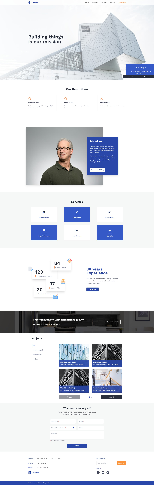

# TheBox Construction Landing Page 🏗️



A modern, sleek landing page for a construction company built with React, Vite, and Tailwind CSS. Featuring a fully responsive design, smooth animations, and a comprehensive project gallery.

## ✨ Features

- Fully responsive design optimized for all screen sizes
- Modern UI with smooth animations and transitions
- Project gallery with filtering and pagination capabilities
- Contact form with custom-built form components
- Smooth scroll navigation for enhanced user experience
- Custom color scheme and typography system

## 🛠️ Tech Stack

- **[React](https://reactjs.org/)** - A JavaScript library for building user interfaces
- **[Vite](https://vitejs.dev/)** - Next generation frontend tooling
- **[Tailwind CSS](https://tailwindcss.com/)** - A utility-first CSS framework
- **[Lucide React](https://lucide.dev/)** - Beautiful & consistent icon system
- **[ESLint](https://eslint.org/)** - Code quality tool

## 🚀 Getting Started

### Prerequisites

- Node.js (version 14 or higher)
- npm or yarn package manager

### Installation

1. Clone the repository:

```bash
git clone https://github.com/yourusername/thebox-landing-page.git
cd thebox-landing-page
```

2. Install dependencies:

```bash
npm install
```

3. Start the development server:

```bash
npm run dev
```

4. Open [http://localhost:5173](http://localhost:5173) in your browser

## 📜 Available Scripts

- `npm run dev` - Starts the development server
- `npm run build` - Creates a production build
- `npm run preview` - Previews the production build locally
- `npm run lint` - Runs ESLint for code quality checking

## 📁 Project Structure

```
src/
├── assets/          # Static files (images, icons)
├── components/      # Reusable UI components
├── constants/       # Configuration and constants
├── sections/        # Main page sections
├── App.jsx         # Root component
├── index.css       # Global styles
└── main.jsx        # Entry point
```

## 🧩 Components

### Core Components

- **CustomInput** - Versatile form input component supporting multiple field types
- **MetricCard** - Displays achievement metrics with accompanying icons
- **ServiceCard** - Presents service information in a consistent format

### Page Sections

- Hero
- Reputation
- About
- Services
- Achievements
- Consultation Banner
- Projects Gallery
- Contact Form
- Footer

## 🎨 Customization

### Colors

Modify the color scheme in `tailwind.config.js`:

```javascript
colors: {
  primary: "#2947a9",
  secondary: "#F9995D",
  "accent-blue": "#3559C7",
  // Add your custom colors here
}
```

### Typography

The project uses "Work Sans" as the primary font family. Customize typography settings in `tailwind.config.js`.

## 🤝 Contributing

1. Fork the repository
2. Create your feature branch (`git checkout -b feature/AmazingFeature`)
3. Commit your changes (`git commit -m 'Add some AmazingFeature'`)
4. Push to the branch (`git push origin feature/AmazingFeature`)
5. Open a Pull Request

## 📄 License

This project is licensed under the MIT License - see the [LICENSE](LICENSE) file for details.

## 👏 Acknowledgments

- Design inspiration from modern construction company websites
- Icons provided by Lucide React
- Project images from internal assets
